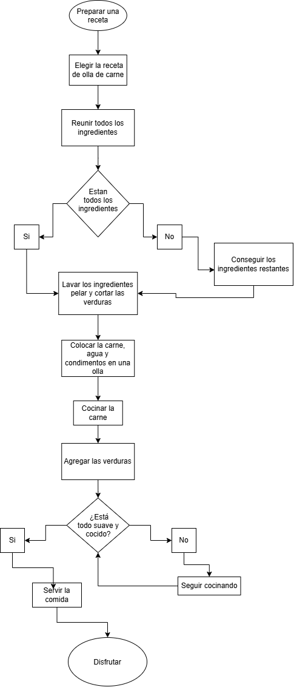

# Semana 1: Hardware, software, algoritmos y diagramas de flujo

## Ejercicio 1: Hardware o software

| Elemento | Clasificación |
|---|---|
| Teclado | Hardware |
| Windows | Software |
| Procesador | Hardware |
| Google Chrome | Software |
| Memoria RAM | Hardware |
| Visual Studio Code | Software |
| Monitor | Hardware |
| SSD | Hardware |

---

## Ejercicio 2: Algoritmo y diagrama de flujo

### Contexto seleccionado

Preparar una receta: olla de carne.

### Algoritmo en lenguaje natural

1. Elegir la receta de olla de carne.
2. Reunir todos los ingredientes.
3. Verificar si están todos los ingredientes.
4. Si falta algún ingrediente, conseguir los ingredientes restantes.
5. Lavar los ingredientes.
6. Pelar y cortar las verduras.
7. Colocar la carne, el agua y los condimentos en una olla.
8. Cocinar la carne.
9. Agregar las verduras.
10. Verificar si todos los ingredientes están suaves y cocidos.
11. Si todavía no están listos, continuar cocinando.
12. Cuando estén listos, servir la comida.
13. Disfrutar la comida.

### Diagrama de flujo

El siguiente diagrama representa el algoritmo utilizado para preparar la receta.

