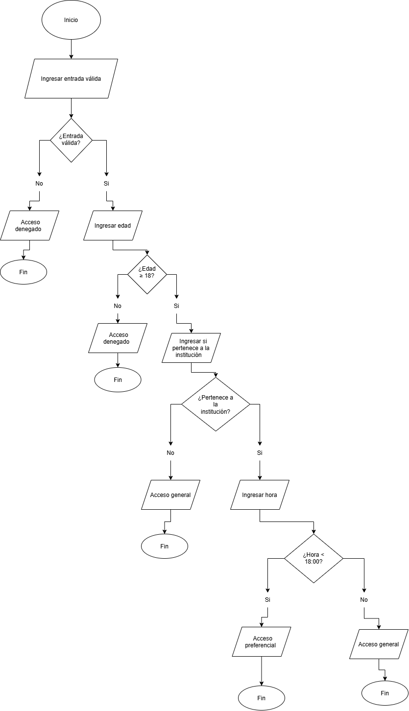

# Modelado de decisiones para el acceso a un evento

## Análisis de las reglas del problema

### 1. ¿Qué datos necesita el sistema para tomar la decisión?

El sistema necesita conocer:

- La edad de la persona.
- Si posee una entrada válida.
- Si pertenece a la institución.
- La hora en la que intenta ingresar.

### 2. ¿Cuáles de esos datos representan valores numéricos?

La edad y la hora de ingreso.

### 3. ¿Cuáles representan respuestas de tipo sí/no?

Si posee una entrada válida y si pertenece a la institución.

### 4. ¿Cuál debería ser la primera condición que evalúe el sistema?

La primera condición debe ser comprobar si la persona posee una entrada válida, porque sin una entrada válida el acceso se deniega inmediatamente y no es necesario continuar evaluando las demás condiciones.

### 5. ¿Qué condiciones hacen que una persona quede inmediatamente fuera del proceso de evaluación?

No poseer una entrada válida o tener menos de 18 años.

### 6. ¿Qué condiciones solamente deben comprobarse después de que se cumplan otras condiciones?

La pertenencia a la institución solamente debe comprobarse después de verificar que la persona tenga una entrada válida y sea mayor de edad.

La hora de llegada solamente necesita comprobarse cuando la persona pertenece a la institución.

### 7. ¿Existe alguna condición que dependa del resultado de una decisión anterior?

Sí. La evaluación de la edad depende de tener una entrada válida. La pertenencia a la institución depende de haber superado las condiciones anteriores y la hora depende de que la persona pertenezca a la institución.

### 8. ¿En qué parte del problema podría aparecer una estructura condicional anidada?

Puede aparecer después de comprobar que la persona posee una entrada válida. Dentro de esa condición se evalúa la edad y posteriormente la pertenencia a la institución y la hora de llegada.

---

## Identificación de las decisiones

| N.º | Regla | Pregunta de decisión | ¿Qué ocurre si se cumple? | ¿Qué ocurre si no se cumple? |
|---|---|---|---|---|
| 1 | Poseer entrada válida | ¿La entrada es válida? | Continúa la evaluación. | Acceso denegado. |
| 2 | Tener 18 años o más | ¿Edad >= 18? | Continúa la evaluación. | Acceso denegado. |
| 3 | Pertenecer a la institución | ¿Pertenece a la institución? | Se evalúa la hora. | Acceso general. |
| 4 | Llegar antes de las 18:00 | ¿Hora < 18:00? | Acceso preferencial. | Acceso general. |

---

## Diagrama de flujo

El siguiente diagrama representa el orden lógico de las decisiones necesarias para determinar el tipo de acceso.

---

## Pregunta clave

### Si una persona no tiene una entrada válida, ¿tiene sentido continuar preguntando su edad, pertenencia a la institución y hora de llegada?

No. Si la persona no posee una entrada válida, el acceso se deniega inmediatamente. Continuar evaluando las demás condiciones sería innecesario.

En el diagrama esto se representa mediante la rama **No** de la decisión sobre la entrada válida, que conduce directamente a "Acceso denegado" y posteriormente al fin del proceso.

---

## Seguimiento de los caminos del diagrama

| Caso | Edad | Entrada válida | Pertenece a la institución | Hora | Resultado según el diagrama |
|---|---:|---|---|---|---|
| 1 | 17 | Sí | Sí | 17:30 | Acceso denegado |
| 2 | 20 | No | Sí | 17:00 | Acceso denegado |
| 3 | 21 | Sí | Sí | 17:45 | Acceso preferencial |
| 4 | 19 | Sí | No | 17:15 | Acceso general |
| 5 | 22 | Sí | Sí | 18:00 | Acceso general |
| 6 | 25 | Sí | No | 19:00 | Acceso general |