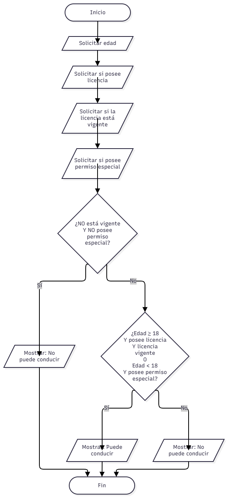

# Condicionales y operadores lógicos

## Ejercicio seleccionado: Permiso para conducir

El programa determina si una persona puede conducir utilizando su edad, la posesión de licencia, la vigencia de la licencia y la existencia de un permiso especial.

## Datos de entrada

- Edad de la persona.
- Si posee licencia de conducir.
- Si la licencia está vigente.
- Si posee permiso especial.

## Condiciones evaluadas

Una persona puede conducir si:

- Tiene 18 años o más, posee licencia y la licencia está vigente.

También puede continuar si:

- Es menor de 18 años y posee permiso especial.

No puede conducir si:

- La licencia no está vigente y tampoco posee permiso especial.

## Operadores lógicos utilizados

### AND (`and`)

Se utiliza cuando varias condiciones deben cumplirse al mismo tiempo.

Ejemplo:

`edad >= 18 and tiene_licencia and licencia_vigente`

En este caso, las tres condiciones deben ser verdaderas.

### OR (`or`)

Se utiliza cuando basta con que una de varias posibilidades sea verdadera.

El programa permite conducir si se cumple la condición del conductor adulto o la condición del permiso especial.

### NOT (`not`)

Se utiliza para negar una condición.

Ejemplo:

`not licencia_vigente and not permiso_especial`

Esta condición comprueba que la licencia no esté vigente y que tampoco exista un permiso especial.

---

## Algoritmo

1. Solicitar la edad.
2. Preguntar si la persona posee licencia.
3. Preguntar si la licencia está vigente.
4. Preguntar si posee permiso especial.
5. Comprobar si la licencia no está vigente y tampoco existe permiso especial.
6. Si ambas condiciones negativas se cumplen, indicar que no puede conducir.
7. En caso contrario, comprobar si:
   - tiene 18 años o más, licencia y licencia vigente; o
   - es menor de 18 años y posee permiso especial.
8. Si se cumple alguna de esas posibilidades, indicar que puede conducir.
9. En cualquier otro caso, indicar que no puede conducir.

---

## Diagrama de flujo

---

## Pruebas

| Prueba | Datos de entrada | Operador o condición comprobada | Resultado esperado | Resultado obtenido |
|---|---|---|---|---|
| 1 | Edad 25, licencia sí, vigente sí, permiso no | `AND` | Puede conducir | Exitosa |
| 2 | Edad 25, licencia sí, vigente no, permiso no | `NOT` y `AND` | No puede conducir | Exitosa |
| 3 | Edad 17, licencia no, vigente no, permiso sí | `OR` | Puede conducir | Exitosa |
| 4 | Edad 17, licencia no, vigente no, permiso no | Condición negativa | No puede conducir | Exitosa |

---

## Ejercicio adicional: Descuento en una tienda

También se desarrolló el ejercicio de descuento especial.

El programa concede un 10 % de descuento cuando:

- el cliente tiene tarjeta frecuente y la compra es de al menos ₡50 000; o
- el cliente tiene 65 años o más.

La condición principal utilizada es:

`(tarjeta_frecuente and monto_compra >= 50000) or edad >= 65`

Este ejercicio permite observar cómo `and` y `or` pueden combinarse en una misma condición.

---

## Reflexión

`and` exige que todas las condiciones relacionadas sean verdaderas. `or` permite que el resultado sea verdadero cuando al menos una alternativa se cumple. `not` invierte el valor lógico de una condición.

En el ejercicio de permiso para conducir, cambiar `or` por `and` produciría un resultado diferente, porque obligaría a cumplir simultáneamente la condición de una persona adulta con licencia y la condición de ser menor de edad con permiso especial. Estas situaciones no pueden cumplirse al mismo tiempo, por lo que el uso de `or` es necesario para representar correctamente las dos alternativas.