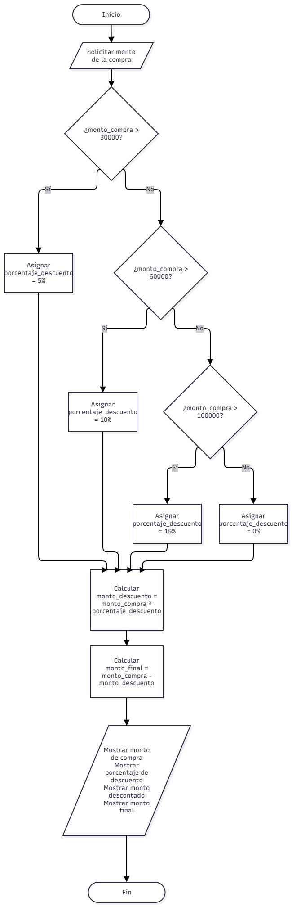

# Análisis y mejora de programas con flujo condicional

Una tienda en línea desea calcular el descuento que recibe un cliente dependiendo del monto de su compra.

Las reglas establecidas son:

- Compras menores de ₡30 000: no tienen descuento.
- Compras desde ₡30 000 hasta menos de ₡60 000: reciben un 5 %.
- Compras desde ₡60 000 hasta menos de ₡100 000: reciben un 10 %.
- Compras de ₡100 000 o más: reciben un 15 %.

---

## Parte 1: Analizar el programa

El programa original pretende calcular un descuento según el monto de una compra. Antes de modificarlo, se analiza su entrada, sus variables y la forma en que se evalúan sus condiciones.

### Código original

```python
compra = float(input("Monto de la compra: "))
descuento = 0

if compra > 30000:
    descuento = compra * 0.05
elif compra > 60000:
    descuento = compra * 0.10
elif compra > 100000:
    descuento = compra * 0.15

total = compra - descuento

print("Descuento:", descuento)
print("Total:", total)
```

### ¿Qué datos recibe el programa?

Recibe el monto de la compra ingresado por el usuario. La función `input()` recibe el dato y `float()` lo convierte a un número decimal. El valor queda almacenado en la variable `compra`.

### ¿Qué variables utiliza?

Utiliza:

- `compra`: guarda el monto ingresado.
- `descuento`: guarda el monto que se rebajará e inicia en 0.
- `total`: almacena el monto final después de restar el descuento.

### ¿Qué decisión o decisiones toma el programa?

Intenta determinar qué porcentaje de descuento aplicar de acuerdo con el monto de la compra: 0 %, 5 %, 10 % o 15 %.

### ¿Qué condiciones se evalúan?

Se evalúan las siguientes condiciones, en este orden:

```python
compra > 30000
compra > 60000
compra > 100000
```

### ¿Qué sucede cuando una condición es verdadera?

Se ejecuta la instrucción asociada a esa condición y se calcula el descuento.

Como se utiliza una estructura `if / elif`, cuando Python encuentra la primera condición verdadera ya no evalúa los `elif` posteriores.

### ¿Qué sucede cuando ninguna condición se cumple?

La variable `descuento` conserva su valor inicial de 0.

Por lo tanto, el total es igual al monto de la compra y no se aplica ningún descuento.

### ¿El orden de las condiciones afecta el resultado?

Sí.

La condición:

```python
compra > 30000
```

aparece primero. Por esta razón, una compra de ₡80 000 o ₡120 000 también cumple esa condición y recibe un descuento del 5 %, sin llegar a evaluarse los descuentos del 10 % o 15 %.

**Idea clave:** en una estructura `if / elif`, Python evalúa las condiciones de arriba hacia abajo y ejecuta solamente la primera rama que resulte verdadera.

---

## Parte 2: Analizar el flujo condicional

El siguiente diagrama representa el funcionamiento actual del código original, sin corregirlo.



### ¿El diagrama representa realmente las reglas establecidas por la tienda?

El diagrama representa correctamente lo que hace el código original, pero ese código no representa correctamente las reglas de la tienda.

El principal problema está en el orden de las condiciones. La primera condición es:

```python
compra > 30000
```

Cualquier monto mayor que ₡30 000 activa el descuento del 5 % y evita que se evalúen los `elif` posteriores.

Además, si `compra > 30000` resulta falsa, significa que la compra es menor o igual a ₡30 000. En ese caso también es imposible que `compra > 60000` o `compra > 100000` resulten verdaderas.

Esto demuestra que las ramas correspondientes al 10 % y al 15 % no pueden alcanzarse correctamente con la estructura actual.

También existe un problema con los valores límite porque se utiliza `>` en lugar de `>=`.

Por ejemplo, una compra exactamente de ₡30 000 no recibe el 5 %, aunque la regla indica que el descuento comienza desde ₡30 000.

---

## Parte 3: Comprobar la funcionalidad del flujo condicional

Se ejecutó el programa original con diferentes montos de compra y se compararon sus resultados con las reglas establecidas por la tienda.

| Compra | Descuento correcto | Total esperado | Resultado del programa | Total obtenido | Estado |
|---:|---:|---:|---:|---:|---|
| ₡20 000 | 0 % = ₡0 | ₡20 000 | ₡0 | ₡20 000 | Correcto |
| ₡30 000 | 5 % = ₡1 500 | ₡28 500 | ₡0 | ₡30 000 | Incorrecto |
| ₡45 000 | 5 % = ₡2 250 | ₡42 750 | ₡2 250 | ₡42 750 | Correcto |
| ₡60 000 | 10 % = ₡6 000 | ₡54 000 | ₡3 000 | ₡57 000 | Incorrecto |
| ₡80 000 | 10 % = ₡8 000 | ₡72 000 | ₡4 000 | ₡76 000 | Incorrecto |
| ₡100 000 | 15 % = ₡15 000 | ₡85 000 | ₡5 000 | ₡95 000 | Incorrecto |
| ₡120 000 | 15 % = ₡18 000 | ₡102 000 | ₡6 000 | ₡114 000 | Incorrecto |

### Análisis de los valores límite

#### ₡30 000

Según las reglas debe recibir un descuento del 5 %.

Sin embargo:

```text
30000 > 30000
```

es falso.

Por lo tanto, el programa mantiene el descuento en 0.

#### ₡60 000

Según las reglas debe recibir un descuento del 10 %.

El programa evalúa primero:

```text
60000 > 30000
```

Esta condición es verdadera, por lo que aplica inmediatamente el 5 % y ya no revisa los `elif` siguientes.

#### ₡100 000

Según las reglas debe recibir un descuento del 15 %.

Sin embargo, el programa evalúa primero:

```text
100000 > 30000
```

La condición es verdadera, por lo que aplica un 5 % y no llega a evaluar la condición correspondiente al 15 %.

### Resultado del análisis de las pruebas

El programa puede ejecutarse sin producir errores de sintaxis, pero eso no significa que su lógica sea correcta.

De los siete casos solicitados, solamente ₡20 000 y ₡45 000 producen el resultado esperado.

---

## Parte 4: Mejorar la calidad de la programación

Después del análisis y las pruebas se identificaron las siguientes mejoras:

- Corregir el orden de las condiciones y evaluar primero el rango más alto.
- Utilizar `>=` para incluir correctamente los valores límite de ₡30 000, ₡60 000 y ₡100 000.
- Utilizar nombres de variables más descriptivos, como `monto_compra`, `monto_descuento` y `total_pagar`.
- Utilizar constantes para los límites y porcentajes.
- Utilizar una rama `else` para representar de forma explícita el caso sin descuento.
- Separar la selección del porcentaje del cálculo del descuento para evitar repetir operaciones.
- Mostrar mensajes más claros al usuario, incluyendo porcentaje aplicado, monto descontado y total a pagar.

Las constantes también facilitan el mantenimiento del programa.

Si la tienda modifica un límite o un porcentaje, basta con cambiar el valor de la constante correspondiente en lugar de buscar el mismo número en diferentes partes del código.

---

## Parte 5: Corregir y mejorar el programa

La versión mejorada evalúa los límites desde el mayor hasta el menor, utiliza `>=` para incluir los valores exactos y determina primero el porcentaje de descuento.

Después realiza los cálculos una sola vez.

### Código corregido

```python
# Límites de los descuentos
LIMITE_5 = 30000
LIMITE_10 = 60000
LIMITE_15 = 100000

# Porcentajes de descuento
PORCENTAJE_5 = 0.05
PORCENTAJE_10 = 0.10
PORCENTAJE_15 = 0.15

# Entrada de datos
monto_compra = float(input("Ingrese el monto de la compra: ₡"))

# Determinar el porcentaje de descuento
if monto_compra >= LIMITE_15:
    porcentaje_descuento = PORCENTAJE_15

elif monto_compra >= LIMITE_10:
    porcentaje_descuento = PORCENTAJE_10

elif monto_compra >= LIMITE_5:
    porcentaje_descuento = PORCENTAJE_5

else:
    porcentaje_descuento = 0

# Calcular descuento y total
monto_descuento = monto_compra * porcentaje_descuento
total_pagar = monto_compra - monto_descuento

# Mostrar resultados
print("\n--- Resumen de la compra ---")
print(f"Monto de la compra: ₡{monto_compra:,.2f}")
print(f"Descuento aplicado: {porcentaje_descuento * 100:.0f}%")
print(f"Monto del descuento: ₡{monto_descuento:,.2f}")
print(f"Total a pagar: ₡{total_pagar:,.2f}")
```

La implementación también se encuentra en:

`descuentos_flujo_condicional.py`

### Explicación de la corrección

- Una compra de ₡120 000 se evalúa primero contra ₡100 000, por lo que recibe un 15 % y no cae antes en el rango del 5 %.
- Una compra de ₡80 000 no cumple el primer límite de ₡100 000, pero sí el de ₡60 000, por lo que recibe un 10 %.
- Una compra de ₡45 000 falla en los dos límites superiores y cumple el de ₡30 000, por lo que recibe un 5 %.
- Una compra de ₡20 000 no cumple ninguno de los límites y entra en `else`, por lo que recibe un 0 %.

---

## Parte 6: Diseñar y ejecutar casos de prueba

Los siguientes casos permiten comprobar todas las ramas del programa corregido:

- un valor por debajo del primer límite;
- valores exactamente iguales a cada límite;
- valores entre los diferentes rangos;
- un valor superior al último límite.

| N.º | Entrada | Condición que debería activarse | Resultado esperado | Resultado obtenido |
|---:|---:|---|---:|---:|
| 1 | ₡20 000 | `else` → 0 % | Total: ₡20 000 | Total: ₡20 000 |
| 2 | ₡30 000 | `monto_compra >= 30000` → 5 % | Total: ₡28 500 | Total: ₡28 500 |
| 3 | ₡45 000 | `monto_compra >= 30000` → 5 % | Total: ₡42 750 | Total: ₡42 750 |
| 4 | ₡60 000 | `monto_compra >= 60000` → 10 % | Total: ₡54 000 | Total: ₡54 000 |
| 5 | ₡80 000 | `monto_compra >= 60000` → 10 % | Total: ₡72 000 | Total: ₡72 000 |
| 6 | ₡100 000 | `monto_compra >= 100000` → 15 % | Total: ₡85 000 | Total: ₡85 000 |
| 7 | ₡120 000 | `monto_compra >= 100000` → 15 % | Total: ₡102 000 | Total: ₡102 000 |

### Pruebas adicionales de frontera

| Entrada | Qué comprueba | Resultado esperado |
|---:|---|---|
| ₡29 999 | Justo debajo de ₡30 000 | 0 % |
| ₡30 000 | Primer límite exacto | 5 % |
| ₡59 999 | Justo debajo de ₡60 000 | 5 % |
| ₡60 000 | Segundo límite exacto | 10 % |
| ₡99 999 | Justo debajo de ₡100 000 | 10 % |
| ₡100 000 | Tercer límite exacto | 15 % |
| ₡100 001 | Justo por encima del último límite | 15 % |

Los resultados del programa corregido coinciden con los resultados esperados en todos los casos.

Esto comprueba que cada rama del flujo condicional se activa en el rango correcto y que los valores límite son tratados correctamente.

---

## Conclusión

El análisis permitió comprobar que un programa puede ejecutarse sin mostrar errores de Python y, aun así, producir resultados incorrectos debido a problemas en su lógica.

En el código original, el orden de las condiciones hacía que prácticamente todas las compras superiores a ₡30 000 recibieran un descuento del 5 %. Además, el uso de `>` dejaba fuera los valores límite.

La versión corregida evalúa los límites de mayor a menor, utiliza `>=`, incorpora constantes y nombres descriptivos, y separa la decisión del porcentaje de los cálculos.

Las pruebas finales demuestran que los cuatro rangos de descuento funcionan de acuerdo con las reglas establecidas por la tienda.