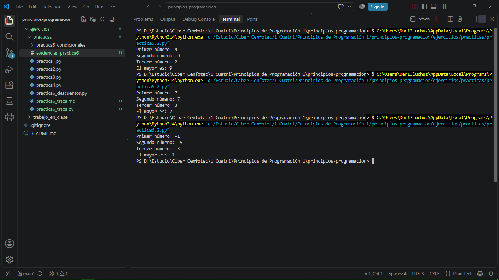

# Práctica 6: Prueba de escritorio

## Programa seleccionado: El mayor de tres números

El programa determina cuál es el mayor de tres números enteros.

---

## Parte 1: Preguntas

### 1. ¿Cuántas veces cambia el valor de `mayor` en cada conjunto?

- Conjunto A: cambia una vez, de 4 a 9.
- Conjunto B: no cambia; permanece en 7.
- Conjunto C: no cambia; permanece en -1.

### 2. Con el conjunto B, ¿se ejecuta la línea 6? ¿Por qué?

No. La condición es `b > mayor`.

En este caso:

`7 > 7`

es falso, porque ambos valores son iguales. Por esta razón, la instrucción `mayor = b` no se ejecuta.

### 3. Si en la línea 4 se escribiera `mayor = 0`, ¿qué mostraría el programa con el conjunto C?

Mostraría:

`El mayor es: 0`

Este resultado sería incorrecto, porque los números ingresados son -1, -5 y -3. Ninguno de ellos es 0.

---

## Parte 2: Tablas de traza

### Conjunto A

Datos: `a = 4`, `b = 9`, `c = 2`

| Paso | Línea | a | b | c | mayor | Condición | Salida |
|---:|---:|---:|---:|---:|---:|---|---|
| 1 | 1 | 4 | | | | | |
| 2 | 2 | | 9 | | | | |
| 3 | 3 | | | 2 | | | |
| 4 | 4 | | | | 4 | | |
| 5 | 5 | | | | | Verdadero | |
| 6 | 6 | | | | 9 | | |
| 7 | 7 | | | | | Falso | |
| 8 | 9 | | | | | | `El mayor es: 9` |

### Conjunto B

Datos: `a = 7`, `b = 7`, `c = 3`

| Paso | Línea | a | b | c | mayor | Condición | Salida |
|---:|---:|---:|---:|---:|---:|---|---|
| 1 | 1 | 7 | | | | | |
| 2 | 2 | | 7 | | | | |
| 3 | 3 | | | 3 | | | |
| 4 | 4 | | | | 7 | | |
| 5 | 5 | | | | | Falso | |
| 6 | 7 | | | | | Falso | |
| 7 | 9 | | | | | | `El mayor es: 7` |

### Conjunto C

Datos: `a = -1`, `b = -5`, `c = -3`

| Paso | Línea | a | b | c | mayor | Condición | Salida |
|---:|---:|---:|---:|---:|---:|---|---|
| 1 | 1 | -1 | | | | | |
| 2 | 2 | | -5 | | | | |
| 3 | 3 | | | -3 | | | |
| 4 | 4 | | | | -1 | | |
| 5 | 5 | | | | | Falso | |
| 6 | 7 | | | | | Falso | |
| 7 | 9 | | | | | | `El mayor es: -1` |

---

## Parte 3: Comprobación de la traza

| Conjunto | Salida según la traza | Salida del programa | ¿Coinciden? | Observaciones |
|---|---|---|:---:|---|
| A | `El mayor es: 9` | `El mayor es: 9` | Sí | `mayor` cambió de 4 a 9. |
| B | `El mayor es: 7` | `El mayor es: 7` | Sí | `mayor` no cambió. |
| C | `El mayor es: -1` | `El mayor es: -1` | Sí | `mayor` permaneció en -1. |

---

### Evidencia de la ejecución

La siguiente captura muestra la ejecución del programa con los tres conjuntos de datos.

---

## Parte 4: Reflexión

### 1. ¿Por qué algunas líneas no aparecen en la traza?

Algunas líneas no aparecen porque solamente se registran las instrucciones que realmente se ejecutan. Cuando una condición de un `if` es falsa, las instrucciones dentro de ese bloque se omiten.

### 2. ¿Qué ventaja tiene hacer la traza antes de ejecutar el programa?

La traza permite analizar paso a paso cómo debería funcionar el programa antes de ejecutarlo. Ayuda a comprender cómo cambian las variables, evaluar las condiciones y detectar posibles errores de lógica.

### 3. ¿Qué conjunto de datos fue más útil para entender el programa? ¿Por qué?

El conjunto A fue el más útil porque permite observar una condición verdadera y otra falsa. Primero `mayor` toma el valor 4, después cambia a 9 porque `b` es mayor y finalmente permanece en 9 porque `c` no lo supera.